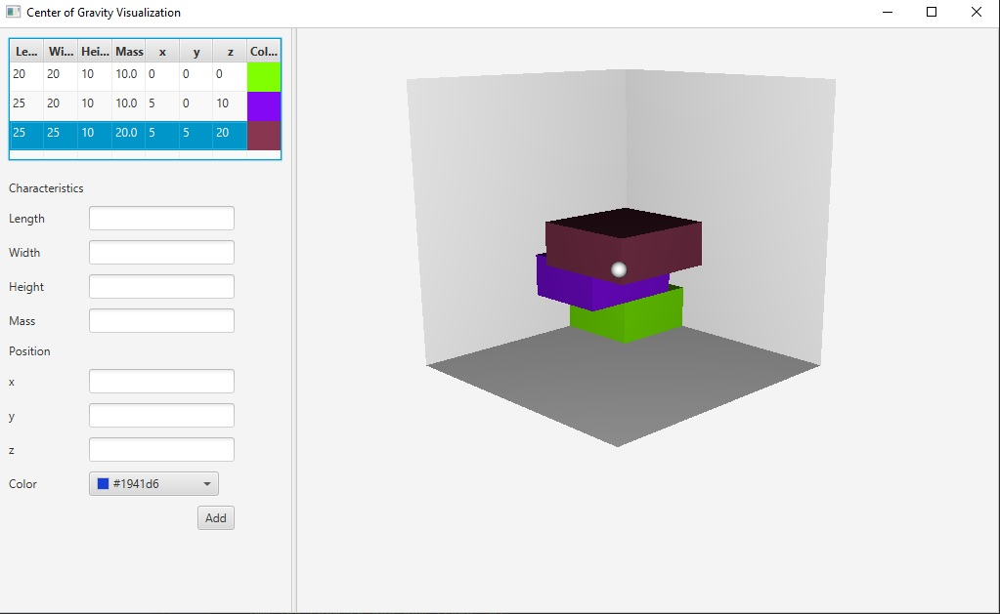
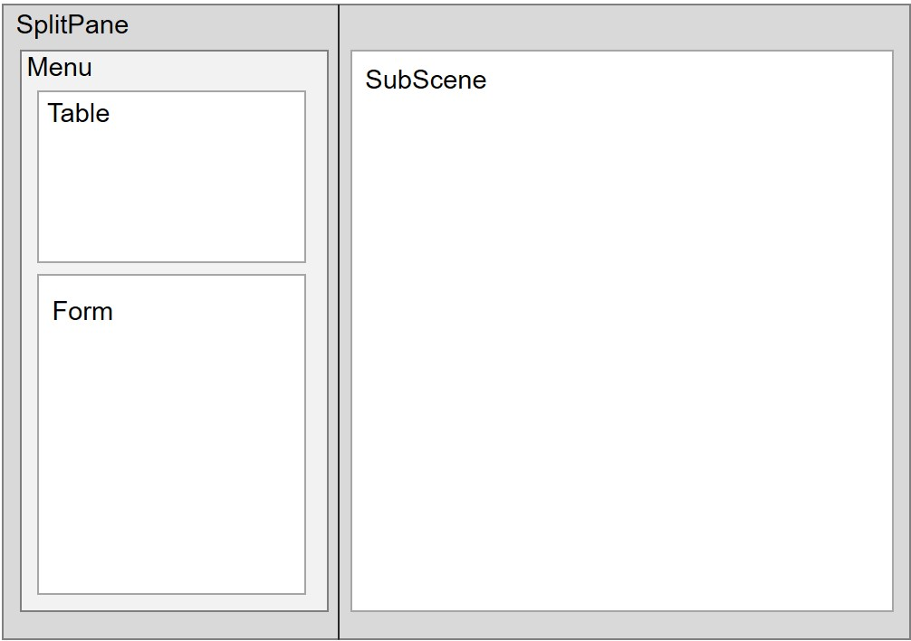

# Center of Gravity (CG) Visualization Tool
This tool visualizes the Center of Gravity of connected 3D cuboid items.

## Build Status

## Functionality
### Add Items
New Items can be added by filling in the form and the click on "Add". 
Please note, that only integer values are allowed except for the mass.
### Edit Items
Added Items are directly displayed in the 3D Scene on the right side 
and are inserted in the Table. The properties can be changed by double-clicking on the field to be changed in the table. 
A textfield appears. The new value is applied by hitting enter.

### Remove Items
An item can be removed by a right-click on the table row representing the item to be deleted.
A context menu appears with the remove option. After clicking on remove, the item is deleted from the 3D SubScene and the table.

## Link to Live-Demo
_Coming soon_

## Programm Code Structure
The Model-View-Presenter (MVP) structure is applied.
Therefore, the DataModel is the repository of item objects.
The view contains the raw javafx elements (Form, Table, 3D SubScene) in order to display the model.
The presenter gets the data from the model and updates the view.

## Layout Structure
The overall content is a SplitPane, containing the menu and the 3D SubScene. 
The menu is a VBox and contains the TableView and the Form to add items (GridPane).
The following image visualizes the layout structure.

